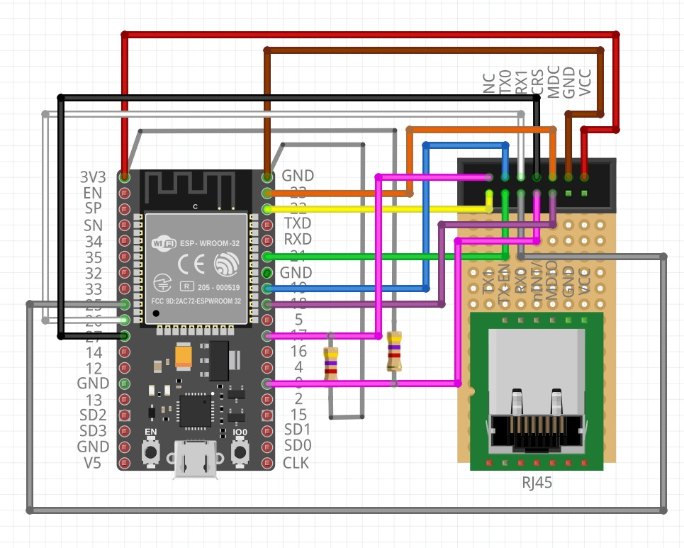

# esp32-ethernet

This repository is intended to be just a simple and straightforward reminder of how to configure a wired Ethernet connection on a ESP32 using a LAN8720 module.

The solucion came from [https://sautter.com/blog/ethernet-on-esp32-using-lan8720/](https://sautter.com/blog/ethernet-on-esp32-using-lan8720/) and [this issue](https://github.com/espressif/arduino-esp32/issues/2907) from the [Arduino core for the ESP32](https://github.com/espressif/arduino-esp32) repo. I simply made a few tries to come up with the same solution as **esp13** and **DarlanJurak** exposed in that issue. I'm even going to take the liberty of using their schematics and code.

I don't have a deep (not even slight) knowledge of the operation of the LAN8720 module. Honestly, I just wanted it to work :)

## Wiring

The wiring is exactly as in [https://sautter.com/blog/ethernet-on-esp32-using-lan8720/](https://sautter.com/blog/ethernet-on-esp32-using-lan8720/). This schematic stolen [from **esp13**](https://github.com/espressif/arduino-esp32/issues/2907) may be clearer:



> **Note:** According to my tests, `GPIO17` connection can be completely removed without affecting the operation of the circuit :confused:.

### Jumping the enable pin of the oscillator in the LAN8720 module and the `NC` pin
I found that this workaround behaved differently on the two tested scenarios:
 - When programming the ESP32 using the Arduino IDE I needed to manually stop the contact immediately after powering on or resetting the board for the connection to work. 
 - Using the ESPHome firmware this connection is not necessary at all.

## Test code

### Arduino IDE

```c
/*
    This sketch shows how to configure different external or internal clock sources for the Ethernet PHY
*/

#include <ETH.h>

/* 
   * ETH_CLOCK_GPIO0_IN   - default: external clock from crystal oscillator
   * ETH_CLOCK_GPIO0_OUT  - 50MHz clock from internal APLL output on GPIO0 - possibly an inverter is needed for LAN8720
   * ETH_CLOCK_GPIO16_OUT - 50MHz clock from internal APLL output on GPIO16 - possibly an inverter is needed for LAN8720
   * ETH_CLOCK_GPIO17_OUT - 50MHz clock from internal APLL inverted output on GPIO17 - tested with LAN8720
*/
#ifdef ETH_CLK_MODE
#undef ETH_CLK_MODE
#endif
#define ETH_CLK_MODE    ETH_CLOCK_GPIO17_OUT

// Pin# of the enable signal for the external crystal oscillator (-1 to disable for internal APLL source)
#define ETH_POWER_PIN   -1

// Type of the Ethernet PHY (LAN8720 or TLK110)
#define ETH_TYPE        ETH_PHY_LAN8720

// I²C-address of Ethernet PHY (0 or 1 for LAN8720, 31 for TLK110)
#define ETH_ADDR        1

// Pin# of the I²C clock signal for the Ethernet PHY
#define ETH_MDC_PIN     23

// Pin# of the I²C IO signal for the Ethernet PHY
#define ETH_MDIO_PIN    18


static bool eth_connected = false;

void WiFiEvent(WiFiEvent_t event) {
  switch (event) {
    case SYSTEM_EVENT_ETH_START:
      Serial.println("ETH Started");
      //set eth hostname here
      ETH.setHostname("esp32-ethernet");
      break;
    case SYSTEM_EVENT_ETH_CONNECTED:
      Serial.println("ETH Connected");
      break;
    case SYSTEM_EVENT_ETH_GOT_IP:
      Serial.print("ETH MAC: ");
      Serial.print(ETH.macAddress());
      Serial.print(", IPv4: ");
      Serial.print(ETH.localIP());
      if (ETH.fullDuplex()) {
        Serial.print(", FULL_DUPLEX");
      }
      Serial.print(", ");
      Serial.print(ETH.linkSpeed());
      Serial.println("Mbps");
      eth_connected = true;
      break;
    case SYSTEM_EVENT_ETH_DISCONNECTED:
      Serial.println("ETH Disconnected");
      eth_connected = false;
      break;
    case SYSTEM_EVENT_ETH_STOP:
      Serial.println("ETH Stopped");
      eth_connected = false;
      break;
    default:
      break;
  }
}

void testClient(const char * host, uint16_t port) {
  Serial.print("\nconnecting to ");
  Serial.println(host);

  WiFiClient client;
  if (!client.connect(host, port)) {
    Serial.println("connection failed");
    return;
  }
  client.printf("GET / HTTP/1.1\r\nHost: %s\r\n\r\n", host);
  while (client.connected() && !client.available());
  while (client.available()) {
    Serial.write(client.read());
  }

  Serial.println("closing connection\n");
  client.stop();
}

void setup() {
  Serial.begin(115200);
  WiFi.onEvent(WiFiEvent);
  ETH.begin(ETH_ADDR, ETH_POWER_PIN, ETH_MDC_PIN, ETH_MDIO_PIN, ETH_TYPE, ETH_CLK_MODE);
}


void loop() {
  if (eth_connected) {
    testClient("google.com", 80);
  }
  delay(10000);
}
```

### ESPHome

```yaml
esphome:
  name: test_esp32_ethernet
  platform: ESP32
  board: esp-wrover-kit

ethernet:
  type: LAN8720
  mdc_pin: GPIO23
  mdio_pin: GPIO18
  clk_mode:  GPIO17_OUT
  phy_addr: 1

#   # Optional manual IP
#   manual_ip:
#     static_ip: 192.168.1.123
#     gateway: 192.168.1.1
#     subnet: 255.255.255.0
    
# Enable logging
logger:
  level: VERBOSE
  
# Enable Home Assistant API
api:

ota:

web_server:
  port: 80
```
